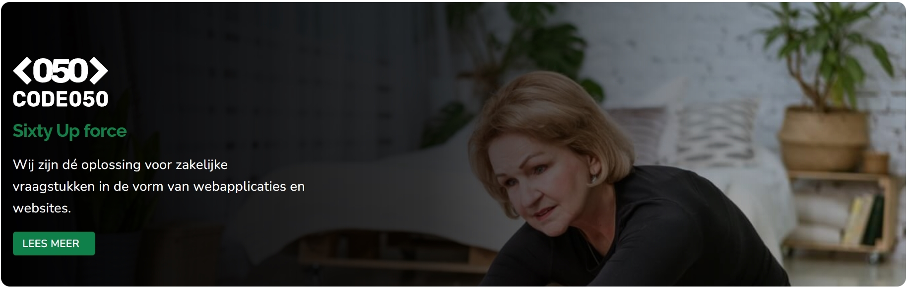

# Banner redirect

### Usage

```blade
<x-navigation.project-redirect>
    <x-slot:image>https://helpx.adobe.com/content/dam/help/enphotoshop/using/convert-color-image-black-white/jcr_contentmain-pars/before_and_after/image-before/Landscape-Color.jpg<x-slot:image>
    <x-slot:icon>https://play-lh.googleusercontent.comp6kS3dCcILt9Z4vRMxHXZTbRecqnZTx5ysBVp6Qe3fDofokRLuWjRxF8J0TkMTGgKo</x-slot:icon>
    <x-slot:title>Title</x-slot:title>
    Sub text can be placed here and will be display using the $slottag
    </x-navigation.project-redirect>
```

### Structure
```Blade
<div
    style="background:linear-gradient(90deg, rgba(0,0,0,1) 0%, rgba(0,0,0,0.8015581232492998) 47%, rgba(0,0,0,0) 100%), url({{$image}}); background-size: cover;"
    class="project-redirect">
    <div class="project-redirect-container">
        
        <h1 class="project-redirect-container-title">{{$title}}</h1>
        <!--Ondertitel-->
        <p class="project-redirect-container-slot">{{$slot}}</p>
        <div>
            <x-ui.buttons.small.primary>
                <p class="mr-2">{{__('Lees meer')}}</p>
                <i class="fa-solid fa-arrow-right"></i>
            </x-ui.buttons.small.primary>
        </div>
    </div>
</div>
```